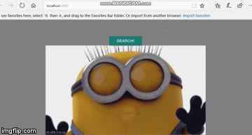

# REACT SAMPLE PROJECT WITH API

This project was bootstrapped with [Create React App](https://github.com/facebookincubator/create-react-app).

Below you will find some information on how to perform common tasks.<br>
You can find the most recent version of this guide [here](https://github.com/facebookincubator/create-react-app/blob/master/packages/react-scripts/template/README.md).

## Sample giphy: minion



## Folder Structures

```
my-app/
  README.md
  node_modules/
  package.json/
  public/
    index.html
  src/
    App.css
    App.js
    App.test.js
    index.css
    index.js
```

## FEATURES
* API
* type in any keyword then it would display the giphy

```
  run npm start
```


```
  localhost:3000
```


